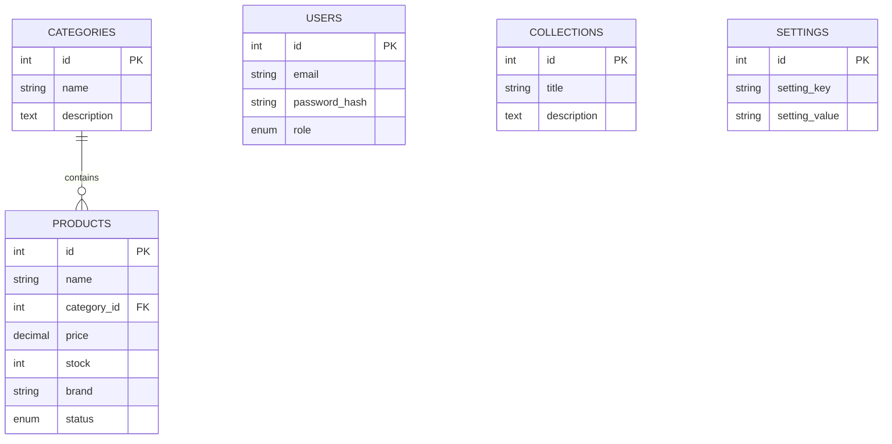

# RealQuillabamba 🛍️

Plataforma de comercio electrónico (E-commerce) con un panel de administración integrado. Este es un proyecto de software de pila completa (Full-Stack) diseñado para la demostración de venta de productos con un enfoque en diseño minimalista y una interfaz de usuario moderna.

## 🛠️ Tecnologías Utilizadas

- **Frontend:** React 19, TypeScript, Vite, Tailwind CSS (+ Lucide React para los íconos).
- **Backend:** PHP nativo (PDO) para proveer una API RESTful.
- **Base de Datos:** MySQL (Relacional).
- **Herramientas de Calidad de Código:** ESLint, Prettier (Formatos).

## ✨ Características Principales

- **Catálogo de Productos:** Visualización de productos con filtros dinámicos (categorías, marcas).
- **Panel Administrativo (CMS):** Gestión completa del inventario, categorías, marcas y configuración general de la tienda (CRUD).
- **Gestión de Configuraciones Estéticas:** Cambio dinámico del nombre de empresa, textos principales e interfaz a través de variables de la base de datos (Backend a Frontend).
- **Diseño Responsive:** Adaptado y optimizado para pantallas en dispositivos móviles y escritorio.

---

## 🚀 Requisitos Previos

Asegúrate de contar con lo siguiente instalado en tu entorno local antes de iniciar:

1. **[Node.js](https://nodejs.org/es/)** (v18 o superior) y npm.
2. Servidor local con **PHP y MySQL** (Se recomienda usar **[XAMPP](https://www.apachefriends.org/es/index.html)**, WAMP o MAMP).

---

## 📦 Instalación y Configuración Local

Sigue los siguientes pasos para correr el servidor frontend de desarrollo y el backend de API local.

### 1. Preparar la Base de Datos
1. Inicia **Apache** y **MySQL** desde el panel de control de XAMPP.
2. Ingresa a `http://localhost/phpmyadmin/`.
3. Crea una base de datos vacía llamada `realquillabamba`.
4. Importa el archivo `database.sql` incluido en la raíz de este proyecto. Esto creará el esquema y algunos datos semilla de prueba (incluyendo un usuario administrador).

### 2. Configurar el Backend (API)
El backend está alojado en la carpeta `api/`.
1. Clona/Mueve este proyecto dentro del directorio de despliegue de tu servidor web (`htdocs` si usas XAMPP).
La ruta final debería verse algo así: `C:\xampp\htdocs\RealQuillabamba`.
2. Verifica la conexión a tu base de datos revisando el archivo `api/config.php`. Por predeterminado:
   - `DB_HOST`: localhost
   - `DB_USER`: root
   - `DB_PASS`: (en blanco)
   - `DB_NAME`: realquillabamba

### 3. Configurar el Frontend (React)
Abre un terminal en la ubicación raíz del proyecto y ejecuta:

```bash
# 1. Instala todas las dependencias
npm install

# 2. Levanta el servidor local de Vite
npm run dev
```

El frontend estará disponible (usualmente) en `http://localhost:5173`. 
> **Nota:** El sistema asume que la API de PHP está respondiendo en `http://localhost/RealQuillabamba/api/`.

---

## 📡 Documentación de la API (Endpoints)

El servidor expone una API REST (PHP) en formato JSON. Estos son los principales Endpoints:

| Endpoint | Método | Funcionalidad |
| :--- | :--- | :--- |
| `/api/auth.php` | `POST` | Autenticación y generación de JWT / Token de sesión basado en usuario. |
| `/api/products.php` | `GET` | Obtiene los productos (filtrable). |
| `/api/products.php` | `POST` / `PUT` / `DELETE`| Modifica los productos (se requiere sesión admin). |
| `/api/categories.php` | `GET` | Lista de categorías de la tienda. |
| `/api/brands.php` | `GET` | Lista dinámica de las marcas operantes. |
| `/api/settings.php` | `GET` / `PUT` | Permite gestionar propiedades estéticas y de texto (ajustes del portal). |

---

## 🗄️ Esquema Lógico de la Base de Datos (ER)

El proyecto utiliza una estructura relacional. A continuación, el esquema principal simplificado:



---
*Este proyecto fue generado y estructurado con Vite.*
